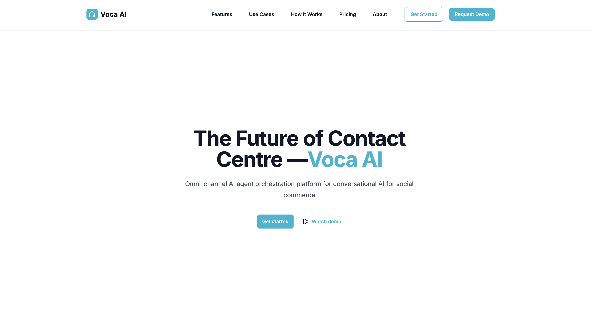

# Voca AI - Omnichannel AI Agent Platform

Voca AI is an intelligent omnichannel AI agent platform designed to help Microfinance Banks and Online Retailers manage customer service efficiently, reduce operational costs, and deliver personalized customer experiences across multiple communication channels.



## Features

### Core Strengths

- **Omnichannel Support**
  - Voice calls, WhatsApp, SMS, and social media integration
  - Unified conversation management across all channels

- **AI-Driven Conversations**
  - Natural, human-like customer conversations with context awareness
  - Customizable conversation flows for banking and e-commerce needs

- **Intelligent Routing & Task Automation**
  - Directs customer queries to the right department or agent
  - Automates repetitive tasks such as account balance checks, loan application status, and order tracking

- **Scalable Architecture**
  - Built with modern web technologies and cloud-ready infrastructure
  - Security-first approach with authentication and authorization

- **Multilingual Capability**
  - Supports multiple languages to serve diverse customer bases

## Architecture

### Frontend
- **Next.js 15** with App Router
- **React 19** for modern UI components
- **TypeScript** for type safety
- **Tailwind CSS** for styling
- **Lucide React** for icons
- **Recharts** for data visualization

### Backend API
- **Next.js API Routes** for server-side functionality
- **RESTful API** design for integrations
- **Authentication & Authorization** system
- **Real-time notifications** support


## Getting Started

### Prerequisites

- Node.js 18+ 
- npm or yarn

### Installation

1. **Clone the repository**
   ```bash
   git clone <repository-url>
   cd voca-ai
   ```

2. **Install dependencies**
   ```bash
   npm install
   ```

3. **Set up environment variables**
   ```bash
   cp .env.example .env.local
   ```
   
   Update `.env.local` with your configuration:
   ```env
   NEXT_PUBLIC_BASE_URL=http://localhost:3000
   NEXT_PUBLIC_API_BASE_URL=http://localhost:3000/api
   
   # Database Configuration
   DATABASE_URL=your-database-url
   
   # Authentication
   NEXTAUTH_SECRET=your-secret-key
   NEXTAUTH_URL=http://localhost:3000
   
   # Feature Flags
   ENABLE_MULTILINGUAL=true
   ENABLE_VOICE_ANALYTICS=true
   ENABLE_SENTIMENT_ANALYSIS=true
   ```

4. **Run the development server**
   ```bash
   npm run dev
   ```

5. **Open your browser**
   Navigate to [http://localhost:3000](http://localhost:3000)

## Pages Overview

### Dashboard
- Overview of key metrics and performance indicators
- Real-time conversation monitoring
- Channel distribution and recent activity
- Agent performance statistics

### Conversations
- Manage and monitor customer interactions
- Filter by status, channel, and search terms
- View conversation details and transcripts
- Agent assignment and routing

### Customers
- Customer database management
- Contact information and interaction history
- Customer segmentation and tagging
- Individual customer profiles and call history

### Analytics
- Detailed performance insights
- Channel performance metrics
- Sentiment analysis and trends
- Language distribution statistics
- Revenue and conversion tracking

### Integrations
- Third-party service connections
- API configuration and management
- Integration health monitoring
- Webhook management

### Settings
- Organization configuration
- Agent management and creation
- Routing rules and automation
- Security and notification preferences
- User profile management

### Catalogs
- Product catalog management
- Store creation and configuration
- Product listing and categorization
- Public catalog viewing

### Orders
- Order management and tracking
- Order history and status updates
- Customer order inquiries
- Order processing workflows

## Use Cases

### For Microfinance Banks
- 24/7 customer service for loan inquiries
- Account information and payment reminders
- KYC verification and loan eligibility checks
- Reduce branch queues with automated support
- Loan application processing and status updates

### For Online Retailers/Vendors
- Handle order inquiries and tracking
- Process returns and refunds
- Product recommendations and inquiries
- Delivery tracking updates
- Upsell and cross-sell opportunities
- Customer support across multiple channels

## Development

### Available Scripts

```bash
npm run dev          # Start development server
npm run dev:turbo    # Start development server with Turbopack
npm run build        # Build for production
npm run start        # Start production server
npm run lint         # Run ESLint
```

### Code Style

- **TypeScript**: Strict mode enabled
- **ESLint**: Configured with Next.js rules
- **Tailwind CSS**: Utility-first styling
- **Component-based architecture**: Reusable and maintainable components

### Component Guidelines

- Use TypeScript interfaces for props
- Implement responsive design with Tailwind CSS
- Follow accessibility best practices
- Use semantic HTML elements
- Implement proper error handling and loading states

## Deployment

### Vercel (Recommended)

1. Connect your GitHub repository to Vercel
2. Configure environment variables in Vercel dashboard
3. Deploy automatically on push to main branch

### Manual Deployment

1. Build the application:
   ```bash
   npm run build
   ```

2. Start the production server:
   ```bash
   npm run start
   ```

## Security

- Environment variables for sensitive data
- Authentication and authorization system
- Input validation and sanitization
- HTTPS enforcement
- Regular security updates
- Protected API routes

## Monitoring & Analytics

- Real-time conversation monitoring
- Performance metrics tracking
- Error logging and alerting
- Customer satisfaction tracking
- Integration health checks
- User activity monitoring

## License

This project is licensed under the MIT License - see the [LICENSE](LICENSE) file for details.

## Support

For support and questions:
- Create an issue in the GitHub repository
- Contact the development team
- Check the documentation

## Roadmap

### Phase 1 (Current)
- Frontend UI/UX implementation
- Authentication and user management
- Basic agent creation and management
- Conversation handling
- Order and catalog management

### Phase 2 (Next)
- Advanced AI integration
- Real-time communication features
- Advanced analytics and reporting
- Mobile responsiveness improvements
- Performance optimizations

### Phase 3 (Future)
- Advanced AI features and customization
- Multi-language support expansion
- Advanced analytics and insights
- Mobile app development
- Enterprise features and integrations

---

**Built for better customer experiences**